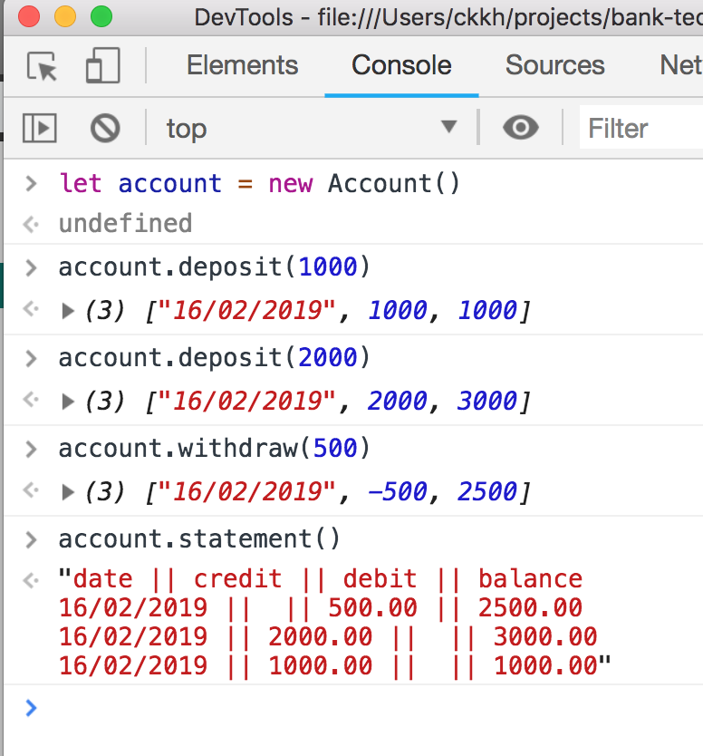

## Requirements & Running
-------------------------

### Dependancies

---------------
1. A browser. Two reccommendations are Google Chrome/Mozella Firefox

2. From the command line navigate to your project directory and clone the repo:

```
git clone git@github.com:CKKH/bank-tech-test.git
cd bank-tech-test
```

### Test results
---------------


To run the test yourself run `open -a "Google Chrome" SpecRunner.html` whilst
in the project repo root. Replace `Google Chrome` with your preferred browser.

### Running project
------------------



To run the project yourself run `open -a "Google Chrome" SpecRunner.html` whilst
in the project repo root. Open your browser's dev tools. From the console, tab,
interact with the project with the following:

- First create an account with `let account = new Account()`
- Make deposits with `account.deposit(number)` - number should be positive
- Make withdrawals with `account.withdraw(number)` - number should be positive
- Print the statement with `account.statement()`

### Code Structure
------------------

The code is structured with good Object Oriented Design principles in mind. It
is split into 6 classes, `Account`, `Debit`, `Credit`, `Balance`, `Formatter`,
and `Printer`. Each holds a single responsibility:

- `Account` acts as the user interface, responsible for allowing a user to
  create and interact with their account. The other classes inject into
  account.
- `Debit` generates a debit transaction.
- `Credit` generates a credit transaction.
- `Balance` calculates the running balance and adds these to a transaction.
- `Formatter` formats transactions
- `Printer` takes the formatted transactions and returns a printed statement.


### User Stories
---------------

```
As a user
So I can have a bank account
I can open an account

As a user
So I don't have to carry cash
I can deposit cash into my account

As a user
So I can get cash when I need it
I can withdraw cash from my account

As a user
So I can keep track of my deposits and withdrawals
They appear when I print my statement

As a user
So I can keep track of my running balance
It appears with each transaction on my statement

As a user
So I can see my most recent activity first
Withdrawals and deposits appear in reverse chronological order
```

## Specification
----------------

### Requirements
----------------

* You should be able to interact with your code via a REPL like IRB or the JavaScript console.  (You don't need to implement a command line interface that takes input from STDIN.)
* Deposits, withdrawal.
* Account statement (date, amount, balance) printing.
* Data can be kept in memory (it doesn't need to be stored to a database or anything).

### Acceptance criteria
-----------------------

**Given** a client makes a deposit of 1000 on 10-01-2012
**And** a deposit of 2000 on 13-01-2012
**And** a withdrawal of 500 on 14-01-2012
**When** she prints her bank statement
**Then** she would see

```
date || credit || debit || balance
14/01/2012 || || 500.00 || 2500.00
13/01/2012 || 2000.00 || || 3000.00
10/01/2012 || 1000.00 || || 1000.00
```
